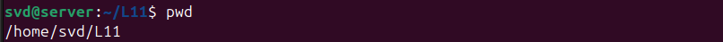
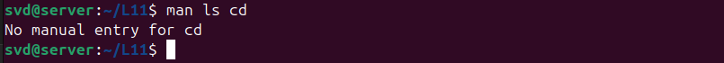
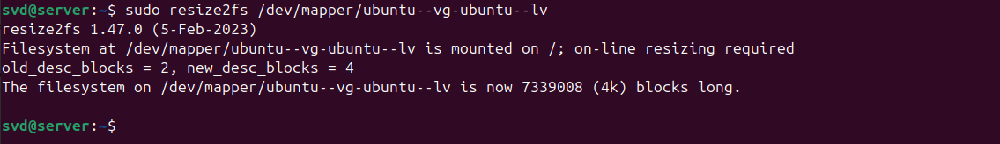

#### 1. Определить путевое имя рабочего каталога. 
   
	Как обозначается корневой каталог? 
   
	Какое путевое имя получили (относительное или абсолютное)?
	Абсолютное.

#### 2. Создать в начальном каталоге два подкаталога. Просмотреть содержимое рабочего каталога. Просмотреть содержимое родительского каталога, не переходя в него.
   
    
#### 3. Перейти в системный каталог. Просмотреть его содержимое. Просмотреть содержимое начального каталога. Вернуться в начальный каталог.
   
    
#### 4. Удалить созданные ранее подкаталоги.
   
#### 5. Получить информацию по командам ls и cd с помощью утилиты man. Изучить структуру man-документа.
   
#### 6. Получить краткую информацию по командам ls и cd с помощью команды whatis и apropos. В чем различие?
###### Команда `whatis` выводит краткое описание указанной команды, программы или утилиты. Она извлекает информацию из базы данных man-страниц.
   
###### Команда `apropos` выполняет поиск по ключевым словам в базе данных man-страниц. Она помогает найти команды, связанные с указанным словом или фразой.(В данном случае выведет список совпадений по 'ls' и 'cd' в алфавитном порядке)
   
#### 7. То же, что и в п.5, только с помощью команды info.
   
#### 8. Создайте в домашнем каталоге следующую структуру подкаталогов (существующие каталоги не удаляйте!)
- |-домашний каталог
	-  |-ВашаФамилия
		- |-1
			- |-2
			- |-3
		- |-4
    
   
### 9. Выведите первые и последние 13 строк файла /etc/group.
   
### **Опционально:**
Расширить дисковое пространство для установленной в рамках Virtualbox операционной системы Ubuntu на 5 гб.

1. Проверяем информацию о виртуальном жестком диске:                          
    
    (Virtual size = 25Gb)(file lenght = 25Gb) 
    
  
2. Увеличиваем размер файла диска на 5 гб(Предварительно выключив VM):
   
3. Проверяем информацию о виртуальном жестком диске                 
    (Virtual size->30Gb)(file lenght = 25Gb): 
	
4. [Далее расширяем диск на Vm:](https://winitpro.ru/index.php/2023/02/21/uvelichit-razdel-diska-ubuntu/)
	Увеличиваем размер физического раздела.
	`sudo cfdisk`
	
5.  После того, как увеличили физический раздел, нужно увеличить размер логического раздела Ubuntu(LVM).
	1. Проверьте свободное место в группе томов LVM с помощью:
		`$ sudo vgdisplay`
	2. Для расширения раздела LVM нужно сначала увеличить PV (Physical Volume).
		
	3. Теперь увеличиваем логический том. Мы расширим том за счет всего доступного пространства.
6. Осталось расширить файловую систему.
	
7. 
   
## Задание 2* (повышенной сложности, опционально):

**Цель:** Получить опыт ручной разметки диска при установке Linux и настройки шифрования.

1.  **Установка Debian с ручной разметкой и шифрованием:**
    * Начните установку минимального образа Debian (например, netinstall, ~300-400 МБ).
    * На этапе разметки диска выберите ручную разметку.
    * Создайте как минимум два раздела (например, один для `/boot` и один для корневой файловой системы `/`).
	     
    * Настройте шифрование для корневого раздела с использованием `LUKS2`.
	    
	    
	    
    * Завершите установку базовой системы Debian.
	    
	
2.  **Установка графического окружения:**
    * После установки базовой системы и перезагрузки войдите в консоль.
	    
    * Установите графическое окружение рабочего стола, например, `KDE Plasma` или `GNOME`.
        * Пример команды для KDE: `sudo apt update && sudo apt install task-kde-desktop`
        * Пример команды для GNOME: `sudo apt update && sudo apt install task-gnome-desktop`
        * Можете установить любое окружение которое вам понравится
    * Настройте систему для запуска графического интерфейса по умолчанию при загрузке.
	    
		
		