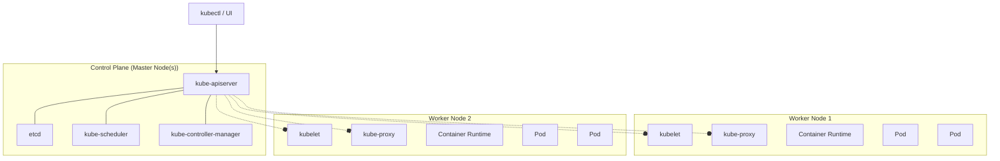

Отличное задание! Давайте разберем его по пунктам и оформим в виде структурированного отчета.

---

# **Домашнее задание №43: Знакомство с Kubernetes**

### **Цель:** Ознакомление с основами Kubernetes и его архитектурой, а также приобретение практических навыков по развертыванию и настройке кластера Kubernetes.

---

## **1. Изучение введения в Kubernetes**

### **a:**
*   **Контейнеризация:** Технология упаковки приложения и всех его зависимостей (библиотеки, runtime-окружение, системные утилиты) в стандартизированную единицу — контейнер. Это гарантирует, что приложение будет одинаково работать в любой среде (разработка, тестирование, продакшен). Основной инструмент — Docker.
*   **Оркестрация** — это автоматизация всего жизненного цикла контейнеризированных приложений: развертывание, управление, масштабирование, сетевые взаимодействия, обеспечение отказоустойчивости и обновление. Kubernetes — ведущий оркестратор.
*   **Автомасштабирование:** Способность Kubernetes автоматически увеличивать или уменьшать количество работающих экземпляров приложения (подов) в зависимости от нагрузки (например, CPU utilization) или по расписанию.

### **b:**

1.  **Отказоустойчивость и высокий уровень доступности (High Availability):** Приложения работают в нескольких копиях. Если контейнер, узел или даже целый дата-центр выходит из строя, Kubernetes автоматически перезапускает приложение на других узлах.
2.  **Горизонтальное масштабирование:** Легко масштабировать приложение "вширь", добавляя новые экземпляры (поды) для обработки повышенной нагрузки, и так же легко уменьшать их количество, когда нагрузка падает.
3.  **Декларативное управление:** Вы описываете *желаемое состояние* вашей системы в YAML-манифестах (например, "я хочу 3 копии моего веб-сервера"). Kubernetes постоянно работает, чтобы привести реальное состояние системы к этому желаемому.
4.  **Самовосстановление (Self-healing):** Kubernetes автоматически перезапускает контейнеры, которые завершились с ошибкой, заменяет и распределяет поды при отказе узлов, и не направляет трафик на неработающие экземпляры.
5.  **Экосистема и переносимость:** Огромное сообщество, множество готовых решений (Helm-чарты, операторы) и возможность запускать кластер практически где угодно: локально, on-premise, в любом публичном облаке.

### **c:**

*   **Микросервисная архитектура:** Идеально подходит для управления десятками и сотнями небольших, слабосвязанных сервисов.
*   **CI/CD (Continuous Integration / Continuous Deployment):** Автоматизация процессов сборки, тестирования и развертывания приложений.
*   **Высоконагруженные и отказоустойчивые приложения:** Веб-сайты и API, которые должны быть доступны 24/7 и выдерживать пиковые нагрузки.
*   **Перенос legacy-приложений в контейнеры:** Для их модернизации и упрощения управления.
*   **Запуск пакетных заданий (Batch jobs) и задач машинного обучения.**

---

## **2. Изучение архитектуры Kubernetes**

### **a:**

### Архитектура Kubernetes построена по принципу "master-worker".

*   **kube-apiserver:** Фронтенд Control Plane. Единственный компонент, с которым взаимодействуют все остальные (пользователи через `kubectl`, рабочие узлы, контроллеры). Отвечает за валидацию и обработку запросов на создание, изменение, удаление ресурсов.
*   **etcd:** Высокодоступное и надежное key-value хранилище. В нем хранится ВСЕ состояние кластера (конфиги, секреты, метаданные, желаемое состояние).
*   **kube-scheduler:** Отвечает за распределение подов по рабочим узлам. При создании пода scheduler оценивает ресурсы узлов (CPU, RAM) и выбирает наиболее подходящий узел для его запуска.
*   **kube-controller-manager:** Запускает на себе различные контроллеры — фоновые процессы, которые следят за состоянием кластера.
    *   **Node Controller:** Отвечает за обнаружение и реагирование на отказы узлов.
    *   **Replication Controller:** Следит за тем, чтобы количество запущенных копий пода (реплик) всегда соответствовало желаемому, указанному в манифесте.
*   **cloud-controller-manager:** (Опционально) Позволяет "привязывать" логику кластера к API конкретного облачного провайдера (например, для создания Load Balancer'ов в AWS или GCP).

#### **b:** 

*   **kubelet:** Агент, работающий на каждом worker node. Его задача — получать от API-сервера "план работы" (PodSpecs) и обеспечивать, чтобы описанные в нем контейнеры были запущены и здоровы.
*   **kube-proxy:** Сетевой прокси, который поддерживает сетевые правила на узлах. Обеспечивает сетевое взаимодействие между подами, сервисами и извне кластера (реализует концепцию Service).
*   **Container Runtime:** Программное обеспечение, необходимое для запуска контейнеров (например, containerd, CRI-O).

### **c:**



---

## **3. Развертывание и настройка кластера Kubernetes**

### **a:**

1.  **Установка Docker:**
    ```bash
    sudo apt update && sudo apt install -y docker.io
    sudo systemctl enable --now docker
    sudo usermod -aG docker $USER && newgrp docker
    ```

2.  **Установка kubectl:**
    ```bash
    curl -LO "https://dl.k8s.io/release/$(curl -L -s https://dl.k8s.io/release/stable.txt)/bin/linux/amd64/kubectl"
    sudo install -o root -g root -m 0755 kubectl /usr/local/bin/kubectl
    ```

3.  **Установка minikube:**
    ```bash
    curl -LO https://storage.googleapis.com/minikube/releases/latest/minikube-linux-amd64
    sudo install minikube-linux-amd64 /usr/local/bin/minikube
    ```

4.  **Запуск кластера:**
    ```bash
    # Запуск с драйвером docker (требуются права)
    minikube start --driver=docker

    # Проверка статуса кластера
    minikube status
    kubectl cluster-info
    ```


### **c:**

Конфигурация кластера и приложений описывается в **YAML-манифестах**. Основные типы ресурсов, которые мы настраиваем:
*   **Pod:** Наименьшая и простейшая единица в объектной модели Kubernetes. Представляет собой группу из одного или нескольких контейнеров.
*   **Deployment:** Описывает *желаемое состояние* для пода или ReplicaSet'а. Управляет развертыванием и обновлением подов (например, rolling update).
*   **Service:** Абстракция, которая определяет логический набор подов и политику доступа к ним. Дает стабильный IP-адрес и DNS-имя.

### **d:**

*   **Безопасность:**
    *   **RBAC (Role-Based Access Control):** Настройка прав доступа для пользователей и сервисных аккаунтов по принципу наименьших привилегий.
    *   **Pod Security Policies / Security Context:** Ограничение прав контейнеров (запрет работы от root, ограничение capabilities).
    *   **Секреты (Secrets):** Хранение конфиденциальных данных (пароли, токены) в зашифрованном виде. Не хранить их в манифестах в открытом виде в git.
    *   **Сетевая политика (NetworkPolicy):** Изоляция трафика между подами по принципу "запрещено все, что не разрешено явно".
    *   **Регулярное обновление:** Своевременно обновлять версии Kubernetes и компонентов для устранения уязвимостей.

*   **Масштабируемость:**
    *   **Horizontal Pod Autoscaler (HPA):** Автоматическое масштабирование количества подов на основе метрик (CPU, RAM, кастомные метрики).
    *   **Cluster Autoscaler:** (В облаках) Автоматическое добавление новых worker nodes в кластер, когда существующим не хватает ресурсов для запуска новых подов.
    *   **Использование Node Pools:** Группы узлов с разными характеристиками (CPU-intensive, GPU, preemptible) для оптимального размещения workloads.

---

## **4. Практическая задача: Развертывание приложения**

**Цель:** Создать и развернуть в minikube-кластере простое веб-приложение (nginx) с доступом из браузера.

### **5. Создание контейнеризированного приложения**

Мы воспользуемся готовым официальным образом `nginx`. Создадим манифесты для его развертывания.

### **6. Развертывание приложения с помощью манифестов**

1.  **Создаем манифест для Deployment (`deployment.yaml`):**
    ```yaml
    apiVersion: apps/v1
    kind: Deployment
    metadata:
      name: nginx-deployment
      labels:
        app: nginx
    spec:
      replicas: 3 # Запустим 3 копии пода
      selector:
        matchLabels:
          app: nginx
      template:
        metadata:
          labels:
            app: nginx
        spec:
          containers:
          - name: nginx-container
            image: nginx:alpine # Используем легкий образ
            ports:
            - containerPort: 80 # Контейнер слушает на 80 порту
            resources:
              requests:
                memory: "64Mi"
                cpu: "50m"
              limits:
                memory: "128Mi"
                cpu: "100m"
    ```

2.  **Создаем манифест для Service (`service.yaml`):**
    ```yaml
    apiVersion: v1
    kind: Service
    metadata:
      name: nginx-service
    spec:
      selector:
        app: nginx # Выбираем все поды с меткой app=nginx
      ports:
        - protocol: TCP
          port: 80 # Порт, на котором сервис будет доступен внутри кластера
          targetPort: 80 # Порт контейнера, на который перенаправлять трафик
      type: NodePort # Делаем сервис доступным снаружи кластера
    ```

3.  **Применяем манифесты:**
    ```bash
    kubectl apply -f deployment.yaml
    kubectl apply -f service.yaml
    ```


### **7. Использование kubectl для управления и мониторинга**

1.  **Проверим созданные ресурсы:**
    ```bash
    # Посмотреть все поды
    kubectl get pods
    # Посмотреть deployment
    kubectl get deployment
    # Посмотреть services
    kubectl get svc
    ```


2.  **Откроем приложение в браузере:**
    Minikube упрощает доступ к сервисам с типом NodePort.
    ```bash
    minikube service nginx-service
    ```


2.  **Просмотр логов пода:**
    ```bash
    # Посмотреть логи конкретного пода
    kubectl logs <pod-name>

    # Посмотреть логи с живым выводом (--follow)
    kubectl logs -f <pod-name>

    # Посмотреть логи пода, если в нем несколько контейнеров
    kubectl logs <pod-name> -c <container-name>
    ```

3.  **Получение подробной информации о ресурсе:**
    ```bash
    # Детальная информация о поде
    kubectl describe pod <pod-name>

    # Детальная информация о сервисе
    kubectl describe svc nginx-service
    ```

4.  **Проверка состояния кластера:**
    ```bash
    # Получить информацию об узлах кластера
    kubectl get nodes -o wide

    # Проверить статус компонентов Control Plane
    kubectl get componentstatuses
    ```


5.  **Масштабирование приложения:**
    ```bash
    # Увеличим количество реплик (подов) с 3 до 5
    kubectl scale deployment nginx-deployment --replicas=5
    kubectl get pods # Убедимся, что создалось 5 подов
    ```

6.  **Отладка (если поды не запускаются):**
    ```bash
    # Если под в статусе Pending
    kubectl describe pod <pod-name> # Ищем события (Events) внизу вывода

    # Если под в статусе CrashLoopBackOff
    kubectl logs <pod-name> # Смотрим логи для определения ошибки
    ```

7.  **Удаление ресурсов:**
    ```bash
    kubectl delete -f deployment.yaml -f service.yaml
    # или
    kubectl delete deployment nginx-deployment
    kubectl delete service nginx-service
    ```

---
